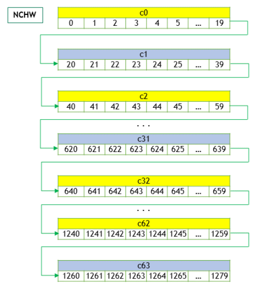
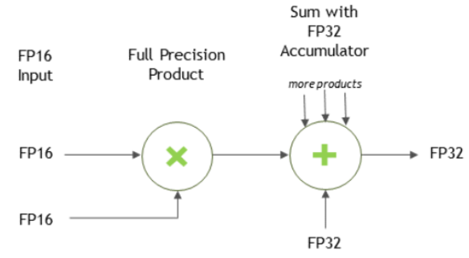

## コア・コンセプト
グラフAPIとレガシーAPIの詳細な説明に入る前に，このセクションでは両者に共通する基本概念を説明します．
### cuDNNハンドル

cuDNNライブラリはホストAPIを提供しますが，GPUを使用する操作については，必要なデータがデバイスから直接アクセス可能であることを前提としています．

cuDNNを使用するアプリケーションは，`cudnnCreate()`を呼び出してライブラリコンテキストのハンドルを初期化する必要があります．このハンドルは，GPUデータを操作するすべての後続のライブラリ関数に明示的に渡されます．アプリケーションがcuDNNの使用を終了したら，このライブラリハンドルに関連するリソースを`cudnnDestroy()`で解放できます．この方法により，ユーザーは複数のホストスレッド，GPU，およびCUDAストリームを使用する際にライブラリの機能を明示的に制御できます．

例えば，アプリケーションはcuDNNハンドルを作成する前に[`cudaSetDevice`](https://docs.nvidia.com/cuda/cuda-runtime-api/group__CUDART__DEVICE.html#group__CUDART__DEVICE_1g69e73c7dda3fc05306ae7c811a690fac)を使用して，異なるデバイスを異なるホストスレッドに関連付けることができます．そして，それぞれのホストスレッド内でユニークなcuDNNハンドルを作成し，その後のライブラリ呼び出しをそのデバイスに関連付けることができます．この場合，異なるハンドルを使用して行われたcuDNNライブラリ呼び出しは，自動的に異なるデバイス上で実行されます．

特定のcuDNNコンテキストに関連付けられたデバイスは，`cudnnCreate()`と`cudnnDestroy()`の呼び出しの間は変更されないと想定されています．同じホストスレッド内で異なるデバイスを使用するためには，アプリケーションは`cudaSetDevice`を呼び出して新しいデバイスを設定し，その後，新しいデバイスに関連付けられる別のcuDNNコンテキストを作成するために`cudnnCreate()`を呼び出す必要があります．

### テンソルとレイアウト

グラフAPIまたはレガシーAPIのどちらを使用する場合でも，cuDNN操作は入力としてテンソルを受け取り，出力としてテンソルを生成します．

#### テンソル記述子

cuDNNライブラリでは，データを次のパラメータで定義された汎用のn次元テンソル記述子で表現します：

- 次元数: 3から8
- データ型: FP32，FP64，FP16など
- 各次元のサイズを定義する整数配列
- 各次元のストライドを定義する整数配列(例：同じ次元の次の要素に到達するために加算する要素数)

このテンソル定義により，次元のストライドを次の次元のサイズとストライドの積よりも小さく設定することで，同じテンソル内でいくつかの次元が重なることが可能です。cuDNNでは，特に指定がない限り，すべてのルーチンが順伝播の入力テンソルに対して重なる次元をサポートしますが，出力テンソルの次元は重なることができません。このテンソル形式は負のストライド(データのミラーリングに有用)もサポートしていますが，特に指定がない限り，cuDNNのルーチンは負のストライドを持つテンソルをサポートしません。

##### WXYZテンソル記述子

テンソル記述子の形式は，それぞれの文字が対応する次元を表す頭字語で識別されます。
このドキュメントでこの用語が使われる場合，次のことを意味します: 

- すべてのストライドは正の値であること
- 文字で表される次元は，それぞれのストライドが降順に並んでいること

##### 3次元テンソル記述子

3次元テンソルは，行列乗算に一般的に使用され，3つの文字: B, M, Nで表されます．Bはバッチサイズ(バッチMatMul用)，Mは行数，Nは列数を表します．詳細については，[`CUDNN_BACKEND_OPERATION_MATMUL_DESCRIPTOR`](https://docs.nvidia.com/deeplearning/cudnn/latest/api/cudnn-graph-library.html#cudnn-backend-operation-matmul-descriptor)を参照してください．

##### 4次元テンソル記述子

4次元テンソル記述子は，2D画像のバッチのフォーマットを定義するために使用され，4つの文字(N, C, H, W)でそれぞれバッチサイズ，特徴マップの数，高さ，幅を表します．
これらの文字はストライドの降順に並んでいます．
一般的に使用される4次元テンソルフォーマットには次のものがあります:  
- NCHW
- NHWC
- CHWN

##### 5次元テンソル記述子

5次元テンソル記述子は，3D画像のバッチのフォーマットを定義するために使用され，5つの文字(N, C, D, H, W)でそれぞれバッチサイズ，特徴マップの数，深さ，高さ，幅を表します．
これらの文字はストライドの降順に並んでいます．
一般的に使用される5次元テンソルフォーマットには次のものがあります: 
- NCDHW
- NDHWC
- CDHWN

##### Fully-Packed テンソル

テンソルが`XYZ-fully-packed`と定義されるのは，次の条件をすべて満たす場合です:  
- テンソルの次元数が「fully-packed」の前にある文字数と等しいこと
- i番目の次元のストライドが、(i+1)番目の次元のサイズと(i+1)番目のストライドの積に等しいこと
- 最後の次元のストライドが1であること

##### Partially-Packed テンソル

部分的に`XYZ-packed`という用語は、部分的にパックされたテンソルを定義する文字を含むテンソル形式にのみ適用されます。
WXYZテンソルが`XYZ-packed`となるのは、次の条件をすべて満たす場合です: 

- `-packed`サフィックスに**含まれない**次元のすべてのストライドが、その次の次元のサイズと次のストライドの積以上であること
- `-packed`サフィックスに**含まれる**各次元のストライドが、その次の次元のサイズと次のストライドの積に等しいこと
- 最後の次元が`-packed`サフィックスに含まれる場合、そのストライドが1であること

例えば、NHWCテンソルが`WC-packed`ということは、`c_stride`が1であり、`w_stride`が`c_dim x c_stride`に等しいことを意味します。
通常、パックされたサフィックスはテンソルの小さい次元に適用されますが、大きい次元に適用されることもあります。
例えば、NCHWテンソルが`N-pacekd`である場合です。

##### 空間的にパックされたテンソル

空間的にパックされたテンソルは，空間次元が部分的にパックされたものとして定義されます．
例えば，空間的にパックされた4次元テンソルは，NCHW HW-packedまたはCNHW HW-pacekdのいずれかであることを意味します．

##### 重なるテンソル

テンソルは、次元の全範囲を反復する際に同じアドレスが複数回生成される場合、重なっていると定義されます。
実際には、重なったテンソルでは、いくつかの次元において`stride[i-1] < stride[i]*dim[i]`となります（ここでiは\[1,nbDims\]の範囲内です）。

#### データレイアウト形式

このセクションでは，cuDNNテンソルがいくつかのデータレイアウト形式に従ってメモリに配置される方法について説明します．

テンソルのレイアウト形式を指定する推奨方法は，そのストライドを設定することです．
v7 APIとの互換性のために，レイアウト形式のサブセットは`cudnnTensorFormat_t`列挙型を通じて設定することもできます．この列挙型は後方互換性の理由でのみ提供されており，非推奨です．

##### テンソルの例

以下の寸法を持つ画像のバッチを考えます：

N: バッチサイズ（1）
C: 特徴マップの数（チャンネルの数）（64）
H: 画像の高さ（5）
W: 画像の幅（4）

例を簡単にするために、画像のピクセル要素は連続する整数（0, 1, 2, 3, …）として表現します。

次のサブセクションでは，この例を使用して異なるレイアウト形式を示します．

##### 畳み込みレイアウト

cuDNNは，次のセクションで説明するいくつかの畳み込みレイアウトをサポートしています．

###### NCHWメモリレイアウト

上記の4次元テンソルは，NCHW形式の場合次のようにメモリに配置されます．

1. 最初のチャンネル(c=0)から始めて，要素は行優先で連続して配置する．
2. 2番目以降のチャンネルに進み，すべてのチャンネルの要素が配置されるまで繰り返す．
3. Nが1より大きい場合は次のバッチに進む

###### NHWCメモリレイアウト

NHWCメモリレイアウトの場合，以下のように各チャンネルの最初の要素が並びます。

1. チャンネル0の最初の要素から始めて，次にチャンネル1の最初の要素に進み，この順番で続けて，すべてのチャンネルの最初の要素を配置する．
2. チャンネル0の2番目の要素から始めて，次にチャンネル1の2番目の要素に進み，この順番で続けて，すべてのチャンネルの2番目の要素を配置する．
3. チャンネル0のすべての要素が行方向に配置されるまで繰り返す。
4. Nが1より大きい場合は次のバッチに進む

###### NC/32HW32メモリレイアウト

NC/32HW32は，NHWCに似ていますが，重要な違いがあります．
NC/32HW32メモリレイアウトでは，64チャンネルがそれぞれ32チャンネルの2つのグループに分割されます．
最初のグループはチャンネルc0からc31，2番目のグループはチャンネルc32からc63で構成されています．
その後，各グループはNHWC形式を使用して配置されます．

一般化されたNC/xHWxレイアウト形式は，次のようになります: 

- チャンネル次元Cのみがxチャンネルごとにグループ化されます．
- x = 1の場合，各グループには1つのチャンネルしかありません．したがって，1つのチャンネル(つまり1つのグループ)の要素は連続して(行優先順序で)配置され，次のグループ(つまり次のチャンネル)に進みます．これはNCHW形式と同じです．
- x = Cの場合，NC/xHWxはNHWCと同じであり，チャンネル深度C全体が1つのグループとして考慮されます．x = Cの場合，次元C全体を1つの大きなベクトルとしてベクトル化し，C全体を配置し，その後残りの次元を配置します．

`cudnnTensorFormat_t`のテンソル形式は，次のように解釈することもできます．
NCHW INT8x32形式は，実際には`N x (C/32) x H x W x 32`(各`W`あたり32個の`C`)であり，NCHW INT8x4形式は`N x (C/4) x H x W x 4`(各`W`あたり4個の`C`)です．
したがって，VECT_Cという名前が付けられています．各WはCのベクトル(4または32)です．

##### MatMulレイアウト

[3次元テンソル記述子](#3次元テンソル記述子)で説明したように，matmulはBMN次元を使用する3Dテンソルを使用します．レイアウトは次のストライドを通じて指定できます．次に，推奨されるレイアウトの2つの例を示します：

- パックされた行優先順序: dim\[B, M, N\]，stride\[MN, N, 1\]
- パックされた列優先順序: dim\[B, M, N\]，stride\[MN, 1, M\]

3Dテンソルのアンパックされたレイアウトもサポートされていますが，そのサポート範囲はより不規則です．

### テンソルコア

cuDNN v7ライブラリは，サポートされているGPU SMバージョンでテンソルコアハードウェアを使用して計算集約的なルーチンを高速化する機能を導入しました．テンソルコアは，NVIDIA Volta GPU以降でサポートされています．

テンソルコアを用いることで行列演算を高速化します．
cuDNNはFP16，FP32，およびINT32値に蓄積するテンソルコア演算を使用します．
`cudnnMathType_t`列挙型を使用して`CUDNN_TENSOR_OP_MATH`に数学モードを設定すると，ライブラリがテンソルコア演算を使用することを示します．
この列挙型は，テンソルコアを有効にするためのオプションを指定し，ルーチンごとに適用する必要があります．

デフォルトモードは`CUDNN_DEFAULT_MATH`であり，テンソルコア操作をライブラリによって避けることを示します．
`CUDNN_TENSOR_OP_MATH`モードはテンソルコアを使用するため，これらの2つのモードは浮動小数点操作の異なる順序のためにわずかに異なる数値結果を生成する可能性があります．

例えば，テンソルコア演算を使用して2つの行列を乗算した結果は非常に近いですが，常に同一ではありません．
スカラー浮動小数点演算のシーケンスを使用して得られる結果と比較すると誤差が生じます。
このため，cuDNNライブラリはテンソルコア操作を有効にする前にユーザーの明示的な設定を必要とします。

ただし，一般的なディープラーニングモデルのトレーニングでの実験では，最終的なネットワークの精度と収束までの反復回数の両方で，テンソルコア演算を用いた場合とスカラー浮動小数点を用いた場合の誤差は無視できることが示されています．
そのため，cuDNNライブラリは両方の動作モードを機能的に区別せず，テンソルコア演算が不適切な場合に代替としてスカラー手法を使用することを許可しています．

テンソルコア操作を使用するカーネル
- 畳み込み
- RNN
- マルチヘッドアテンション

詳細については，[NVIDIA Training with Mixed Precision](https://docs.nvidia.com/deeplearning/performance/mixed-precision-training/index.html)を参照してください．

ディープラーニングコンパイラのための主なガイドライン

- 畳み込み操作がテンソルコアに適していることを確認するために，大きなパディングと大きなフィルタの組み合わせを避けます．
- 入力とフィルタをNHWCに変換し，チャンネルとバッチサイズを8の倍数に事前パディングします．
- ユーザー提供のテンソル，ワークスペース，および予約スペースが128ビット境界に揃っていることを確認します．1024ビットアライメントは，より良いパフォーマンスを提供することができます．

#### テンソルコアの精度に関する注記

FP16データの場合，テンソルコアはFP16入力で動作し，FP16出力を行い，FP16またはFP32で蓄積される可能性があります．
FP16乗算は完全精度の結果をもたらし，`m x n x k`次元を持つ行列のドット積の他の積と共にFP32で蓄積されます．
FP32蓄積，FP16出力の場合，アキュムレータの出力はFP16にダウンキャストされます．一般に，蓄積タイプは出力タイプと同等かそれ以上の精度です．

