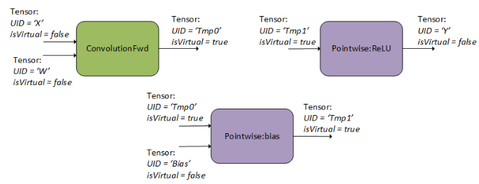
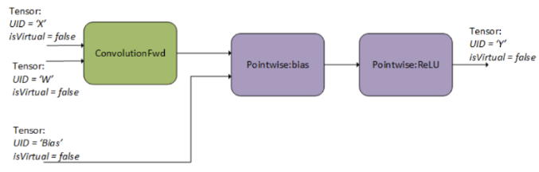
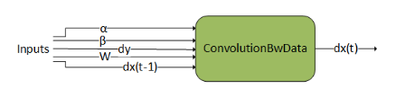
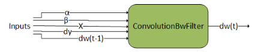
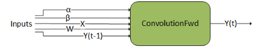
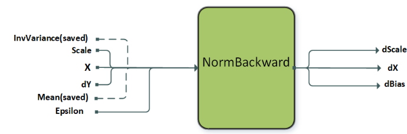

## Graph API

cuDNNライブラリは、計算を操作のグラフとして記述するための宣言的なプログラミングモデルを提供します。
このグラフAPIは、操作の融合の重要性が増す中、より柔軟なAPIを提供するためにcuDNN 8.0で導入されました。

ユーザは操作のグラフを構築することから始めます。
高レベルでは、ユーザはテンソル上の操作のデータフローグラフを記述します。
完成したグラフをもとに、ユーザーはそのグラフを実行できるエンジンを選択します。
エンジンの選択にはいくつかの方法があり、使いやすさ、実行時のオーバーヘッド、エンジン性能に関してトレードオフがあります。

グラフAPIには2つのエントリーポイントがあります:
- Backend Descriptor Types（グラフAPIへの最も低レベルのエントリーポイント）
- NVIDIA cuDNN Frontend API（CバックエンドAPIの上にある便利なレイヤー）

ほとんどのユーザーは次の理由からcuDNNフロントエンドAPIを好むと予想されます:

- 冗長性が少なくても制御の損失はない - バックエンドAPIを通じてアクセス可能なすべての機能がフロントエンドAPIでもアクセス可能。
- バックエンドAPIに追加の機能を提供 - エラーフィルターや自動チューニングなど。
- オープンソース。

どちらの場合でも（バックエンドまたはフロントエンドAPI）、高レベルの概念は同じです。

### 重要な概念

グラフAPIの重要な概念は以下の通りです:

- [操作と操作グラフ](#操作と操作グラフ)
- [エンジンとエンジン設定](#エンジンとエンジン設定)
- [ヒューリスティック](#ヒューリスティック)

これらの概念については、以下のサブセクションで説明します。
後で、これらを結びつける例を示します。

#### 操作と操作グラフ

操作グラフは、テンソル上の操作のデータフローグラフです。これは数学的な仕様を意味しており、それを実装できる基礎となるエンジンから独立しています。グラフに対して利用可能なエンジンが複数存在する可能性があります。

I/Oテンソルは操作を暗黙的に接続します。
例えば、操作AがテンソルXを生成し、それを操作Bが消費する場合、操作Bは操作Aに依存することを意味します。

#### エンジンとエンジン設定

特定の操作グラフに対して、そのグラフを実装する候補となるエンジンがいくつか存在します。候補エンジンのリストを問い合わせる典型的な方法は、以下で説明するヒューリスティッククエリを通じて行われます。

エンジンには、タイルサイズなどのエンジンのプロパティを設定するためのパラメータが存在します（`cudnnBackendKnobType_t`を参照）。

#### ヒューリスティック

ヒューリスティックとは、特定の操作グラフに対して最もパフォーマンスが高いものから最も低いものまでのエンジン設定のリストを取得する方法です。3つのモードがあります:

- `CUDNN_HEUR_MODE_A` - ほとんどの操作グラフパターンに対応でき、予想されるパフォーマンスでランク付けされたエンジン設定のリストを高速に返します。
- `CUDNN_HEUR_MODE_B` - mode Aより一般的に正確ですが、エンジン設定リストを返すまでのCPUレイテンシが高いというトレードオフがあります。mode Aが良い結果を出せることが分かっている場合には、mode Aを代わりに使う場合があります。
- `CUDNN_HEUR_MODE_FALLBACK` - 最適なパフォーマンスを期待しない場合に機能的な代替案を高速に得ることができます。

推奨されるワークフローは、モードAまたはBのいずれかをクエリし、サポートを確認することです。サポートのある最初のエンジン設定が最もパフォーマンスが高いと予想されます。

自動チューニング、すなわちエンジン設定のリストを繰り返し試し、特定のデバイス上で特定の問題に最適なものを選択することができます。
cuDNNフロントエンドAPIは、これを行う便利な関数`cudnnFindPlan()`を提供します。

### グラフAPIの命令の融合例
このセクションでは畳み込み、バイアス、および活性化の融合を実装しています。

#### 操作とテンソル記述子の作成によるグラフデータフローの指定

まず、3つのcuDNNバックエンド操作記述子を作成します。

次の図では、ユーザーは1つのフォワード畳み込み操作（`CUDNN_BACKEND_OPERATION_CONVOLUTION_FORWARD_DESCRIPTOR`を使用）、
バイアス追加のためのポイントワイズ操作（`CUDNN_BACKEND_OPERATION_POINTWISE_DESCRIPTOR`を使用し、モードは`CUDNN_POINTWISE_ADD`）、
およびReLU活性化のためのポイントワイズ操作（`CUDNN_BACKEND_OPERATION_POINTWISE_DESCRIPTOR`を使用し、モードは`CUDNN_POINTWISE_RELU_FWD`）を指定しています。

これらの記述子のアトリビュートを設定する詳細については、[Backend Descriptor Types](https://docs.nvidia.com/deeplearning/cudnn/latest/api/cudnn-graph-library.html#graph-backend-desc-types)を参照してください。
順方向畳み込みを設定する方法の例については、[Setting Up An Operation Graph For A Grouped Convolution use case](https://docs.nvidia.com/deeplearning/cudnn/latest/api/cudnn-graph-library.html#graph-setup-op)を参照してください。

また、グラフ内のすべての操作の入力と出力のためのテンソル記述子も作成する必要があります。
グラフデータフローはテンソルの割り当てによって暗示されます。
例えば、バックエンドテンソル`Tmp0`を畳み込み操作の出力およびバイアス操作の入力として指定することで、cuDNNはデータフローが畳み込みからバイアスに流れることを推測します。
同様にテンソル`Tmp1`についても同じです。ユーザーが中間結果`Tmp0`および`Tmp1`を他の目的で必要としない場合、これらを仮想テンソルとして指定することができ、後でメモリI/Oを最適化することができます。

> * 複数の操作ノードを持つグラフはインプレース操作（つまり、入力UIDが出力UIDと一致する場合）をサポートしていません。このような操作は後のグラフ解析で循環と見なされ、サポートされません。インプレース操作は単一ノードグラフではサポートされます。
> 
> * 操作記述子は任意の順序で作成し、cuDNNに渡すことができます。テンソルUIDがグラフの依存関係を決定するのに十分です。

#### 操作グラフの完成

次に、ユーザーは操作グラフを決定します。操作グラフを決定する一環として、cuDNNはデータフロー解析を行い、操作間の依存関係を確立し、エッジを接続します。以下の図に示すように、cuDNNはこのステップでグラフの有効性を確認するさまざまなチェックを行います。

#### 操作グラフを実行するエンジンの設定

決定した操作グラフをもとに、ユーザーはそのグラフを実行するエンジンを選択し、実行プランを作成します。
一般的には次のように作成します:

1. ヒューリスティックモードAまたはBをクエリする。
2. 機能的なサポートを持つ最初のエンジン設定を探す（または機能的なサポートを持つすべてのエンジン設定を自動チューニングする）。
3. (2)でエンジン設定が見つからなかった場合、フォールバックヒューリスティックをクエリして追加のオプションを探す。

#### エンジンの実行

最後に、ユーザーはワークスペースポインタ、UIDの配列、およびデバイスポインタの配列を提供することでバックエンドバリアントパックを構築します。
UIDとポインタは対応する順序でなければなりません。
ハンドル、実行プラン、およびバリアントパックを使用して実行APIを呼び出し、GPU上で計算を行います。

### サポートされているグラフパターン
cuDNNグラフAPIは、一連のグラフパターンをサポートしています。これらのパターンは多数のエンジンによってサポートされており、それぞれが独自のサポート範囲を持っています。
これらのエンジンは、以下の4つのサブセクションに示されるように、4つの異なるクラスにグループ化されています: 
プリコンパイルされた単一操作エンジン、汎用ランタイム融合エンジン、特化ランタイム融合エンジン、および特化プリコンパイル融合エンジン。
特化エンジンは、ランタイムコンパイルまたはプリコンパイルを使用するかにかかわらず、重要なユースケースのセットにターゲットを絞っており、現在サポートされているパターンのセットは比較的限られています。
将来的には、汎用ランタイム融合エンジンを使用して、より多くのユースケースをサポートすることが期待されています。

これらのエンジンはサポートするパターンに一部重複があるため、特定のパターンが非負整数個のエンジンに対応することがあります。

#### プリコンパイル済みのシングル操作エンジン

一つの基本的なエンジンのクラスには、プリコンパイルされたエンジンが含まれます。
これらは、以下のいずれか1つの操作を持つ操作グラフをサポートします: 
`ConvolutionFwd`、`ConvolutionBwdFilter`、`ConvolutionBwdData`、または`ConvolutionBwBias`。
それらのより正確なサポート範囲は、NVIDIA cuDNN APIリファレンスに記載されています。

##### ConvolutionBwdData

`ConvolutionBwdData`は、テンソル`dy`の畳み込みデータ勾配を計算します。
さらに、スケーリング係数ɑとꞵを使用して、この結果を前の出力とブレンドします。
このグラフ操作は、`cudnnConvolutionBackwardData()`と似ています。

##### ConvolutionBwFilter

`ConvolutionBwdFilter`は、テンソル`dy`の畳み込みフィルタ勾配を計算します。
さらに、スケーリング係数ɑとꞵを使用して、この結果を前の出力とブレンドします。
このグラフ操作は、`cudnnConvolutionBackwardFilter()`と似ています。

##### ConvolutionFwd

`ConvolutionFwd`は、フィルタデータWを使用してXの畳み込みを計算します。
さらに、スケーリング係数ɑとꞵを使用して、この結果を前の出力とブレンドします。
このグラフ操作は、cudnnConvolutionForward()と似ています。

##### NormalizationBackward

`NormalizationBackward`は、勾配`dX`およびスケールとバイアスの勾配`dScale`および`dBias`を計算します。
この操作は、アトリビュート`CUDNN_ATTR_OPERATION_NORM_BWD_MODE`によって設定される複数のモードをサポートしています。
プリコンパイルされたエンジンはインスタンスおよびレイヤー正規化の後方計算をサポートし、バッチ正規化の後方計算は特化されたランタイムコンパイルエンジン（DReluForkDBnを参照）によってサポートされています。
前方のトレーニングパス中に保存された平均と分散は、`NormBackward`操作への入力として渡されます。

`NormalizationBackward`におけるインスタンス正規化、レイヤー正規化および、RMS正規化
| ノードおよびその他の属性                | インスタンス正規化の後方計算                  | レイヤー正規化の後方計算                     | RMS正規化の後方計算                         |
|---------------------------------------|---------------------------------------------|---------------------------------------------|-------------------------------------------|
|`operation`                            |`normBwd`                                    |`normBwd`                                    |`normBwd`                                  |
|`X`                                    | [N,C,(D),H,W], 入力, I type                 | [N,C,(D),H,W], 入力, I type                  | [N,C,(D),H,W], 入力, I type               |
|`Mean`                                 | [N,C,(1),1,1], 入力, compute type           | [N,1,(1),1,1], 入力, compute type            | 該当なし                                  |
|`InvVariance`                          | [N,C,(1),1,1], 入力, compute type           | [N,1,(1),1,1], 入力, compute type            | [N,1,(1),1,1], 入力, compute type         |
|`Scale`                                | [1,C,(1),1,1], input weight, W type         | [1,C,(D),H,W], input weight, W type         | [1,C,(D),H,W], input weight, W type       |
|`DY`                                   | [N,C,(D),H,W], 入力, O type                 | [N,C,(D),H,W], 入力, O type                  | [N,C,(D),H,W], 入力, O type               |
|`DX`                                   | [N,C,(D),H,W], 出力, I type                 | [N,C,(D),H,W], 出力, I type                  | [N,C,(D),H,W], 出力, I type               |
|`Dscale`                               | [1,C,(1),1,1], 出力, W type                 | [1,C,(D),H,W], 出力, W type                  | [1,C,(D),H,W], 出力, W type               |
|`Dbias`                                | [1,C,(1),1,1], 出力, W type                 | [1,C,(D),H,W], 出力, W type                  | 任意                                      |
|`mode`                                 | `CUDNN_INSTANCE_NORM`                       | `CUDNN_LAYER_NORM`                          | `CUDNN_RMS_NORM`                          |
| サポートされるレイアウト                | NC(D)HW, N(D)HWC                            | NC(D)HW, N(D)HWC                            | NC(D)HW, N(D)HWC                          |
| サポートされるI/O type                 | FP16, FP32, BF16                            | FP16, FP32, BF16                            | FP16, FP32, BF16                          |
| サポートされる計算タイプ                | FP32                                        | FP32                                        | FP32                                      |
| サポートされるW type                   | FP32                                        | FP16, FP32, BF16                            | FP16, FP32, BF16                          |
| I/O typeのアラインメント要件           | 8バイトアライン                               | 16バイトアライン                             | 16バイトアライン                            |

各操作について、すべてのテンソルは同じレイアウトである必要があります。
混合I/O typeや混合compute typeはサポートされていません。

レイヤー正規化およびRMS正規化も、特化されたランタイムコンパイルエンジンによってサポートされています。
これらの正規化の後方計算操作に対しては、`CUDNN_ATTR_ENGINE_GLOBAL_INDEX = 3`が適用されます。これらのより高性能なエンジンでは、`sizeof(Itype) >= sizeof(Otype)`という制限が適用されます。

##### NormalizationForward
`NormalizationForward`は、入力`X`から正規化出力`Y`を計算します。
この操作は、推論フェーズとトレーニングフェーズの両方で使用されます。
フェーズはアトリビュート`CUDNN_ATTR_OPERATION_NORM_FWD_PHASE`によって区別されます。

| ノードおよびその他の属性                | インスタンス正規化の前方計算                  | レイヤー正規化の前方計算                     | RMS正規化の前方計算                         |
|---------------------------------------|---------------------------------------------|---------------------------------------------|---------------------------------------------|
|`operation                             |`normFwd`                                     |`normFwd`                                     |`normFwd`                                    |
|`X                                     | [N, C, (D), H, W], input, I type             | [N, C, (D), H, W], input, I type             | [N, C, (D), H, W], input, I type             |
|`Mean                                  | [N,C,(1),1,1], output, compute type,fmode `CUDNN_NORM_FWD_TRAINING`にのみ適用 | [N,1,(1),1,1], output, compute type, fmode `CUDNN_NORM_FWD_TRAINING`にのみ適用 | N/A |
|`InvVariance`                          | [N,C,(1),1,1], output, compute type,fmode `CUDNN_NORM_FWD_TRAINING`にのみ適用 | [N,1,(1),1,1], output, compute type, fmode `CUDNN_NORM_FWD_TRAINING`にのみ適用 | [N,1,(1),1,1], output, compute type, fmode `CUDNN_NORM_FWD_TRAINING`にのみ適用 |
|`Scale`                                | [1,C,(1),1,1], input weight, W type          | [1,C,(D),H,W], input weight, W type          | [1,C,(D),H,W], input weight, W type          |
|`Bias`                                 | [1,C,(1),1,1], input weight, W type          | [1,C,(D),H,W], input weight, W type          | Optional (no bias by default)               |
|`Y`                                    | [N, C, (D), H, W], output, O type            | [N, C, (D), H, W], output, O type            | [N, C, (D), H, W], output, O type            |
|`epsilonDesc`                          | [1,1,1,1], input, constant                   | [1,1,1,1], input, constant                   | [1,1,1,1], input, constant                   |
|`mode`                                 | `CUDNN_INSTANCE_NORM`                          | `CUDNN_LAYER_NORM`                             | `CUDNN_RMS_NORM`                               |
| Supported `fmode`                      | `CUDNN_NORM_FWD_TRAINING`, `CUDNN_NORM_FWD_INFERENCE` | `CUDNN_NORM_FWD_TRAINING`, `CUDNN_NORM_FWD_INFERENCE` | `CUDNN_NORM_FWD_TRAINING, CUDNN_NORM_FWD_INFERENCE` |
| サポートされるレイアウト                | NC(D)HW, N(D)HWC                             | NC(D)HW, N(D)HWC                             | NC(D)HW, N(D)HWC                             |
| サポートされるI/Oタイプ           | FP16, FP32, BF16                             | FP16, FP32, BF16                             | FP16, FP32, BF16                             |
| サポートされる計算タイプ               | FP32                                         | FP32                                         | FP32                                         |
| サポートされるウェイトタイプ, W type    | FP32                                         | FP16, FP32, BF16                             | FP16, FP32, BF16                             |
| I/Oタイプのアラインメント要件           | 8バイトアライン                               | 16バイトアライン                             | 16バイトアライン                             |

各操作に対して、すべてのテンソルは同じレイアウトである必要があります。

レイヤー正規化（Layer Norm）およびRMS正規化（RMS Norm）は、特化されたランタイムコンパイルエンジンによってもサポートされています。
これには、`fmode`が`CUDNN_NORM_FWD_TRAINING`に設定された`CUDNN_ATTR_ENGINE_GLOBAL_INDEX = 3`および`fmode`が`CUDNN_NORM_FWD_INFERENCE`に設定され<た`CUDNN_ATTR_ENGINE_GLOBAL_INDEX = 4`が含まれます。
これらの高性能なエンジンには、`sizeof(Itype) >= sizeof(Otype)`の制約が適用されます。
ランタイムコンパイルされていないエンジンの場合、W型は計算型です。

##### ジェネリックランタイム融合エンジン
前のセクションで説明したエンジンは単一操作パターンをサポートしています。
もちろん、融合を面白くするためには、グラフが複数の操作をサポートする必要があります。
そして理想的には、サポートされるパターンが多様なユースケースをカバーするために柔軟である必要があります。
この一般性を達成するために、cuDNNはグラフパターンに基づいてランタイムでカーネル（またはカーネル群）を生成するランタイム融合エンジンを備えています。
このセクションでは、これらのランタイム融合エンジン（つまり、`CUDNN_BEHAVIOR_NOTE_RUNTIME_COMPILATION`行動メモのあるエンジン）によってサポートされるパターンの概要を示します。

サポート表面を以下の一般的なパターンをカバーするものと考えることができます：

- MatMul融合: $g_2(C = \rm{matmul}(A = g_{1A}(\rm{inputs}), B = g_{1B}(\rm{inputs})),\rm{inputs})$
- ConvolutionFwd融合: $g_2(Y = \rm{convolutionFwd}(X = g_1(\rm{inputs}), W),\rm{inputs})$
- ConvolutionBwdFilter融合: $g_2(dw = \rm{convolutionBwdFiler}(dy, X = g_1(\rm{inputs})), \rm{inputs})$
- ConvolutionBwdData融合: $g_2(dx = \rm{convolutionBwdData}(dy = g_1(\rm{inputs}), W), \rm{inputs})$
- Pointwise融合: $g_2(\rm{inputs})$

> Note
> * $g_1$（ $g_{1A}$ および $g_{1B}$ を含む）は、MatMulおよび畳み込み操作の入力に適用される融合操作を示します。
> * $g_2$は、MatMulおよび畳み込み操作の出力に適用される融合操作を示します。
> * $g_2$には、複数の出力が存在する場合があります。
> * $g_1$の融合パターンはメインループ融合と呼ばれ、 $g_2$ の融合パターンはエピローグ融合と呼ばれます。
> * $g_2$に向かう矢印は、 $g_2$ の任意のノードに入ることができ、必ずしもルートノードに入力する必要はありません。
> * 視覚化のために、図や本文全体で操作の略記法が使用されています。

##### サポート表面

汎用ランタイム融合エンジンには、90、80、および70としてインデックス付けされた3つの独立したサポート表面が含まれています。少なくとも1つのサポート表面の要件を満たすcuDNNグラフは、汎用ランタイム融合エンジンによって実行可能です。以下の表は、各サポート表面の特徴の概要を示しています。最高のパフォーマンスを得るために、可能な限り最も高いインデックスのサポート表面をターゲットにし、必要に応じてインデックスの低いサポート表面にフォールバックすることを推奨します。
